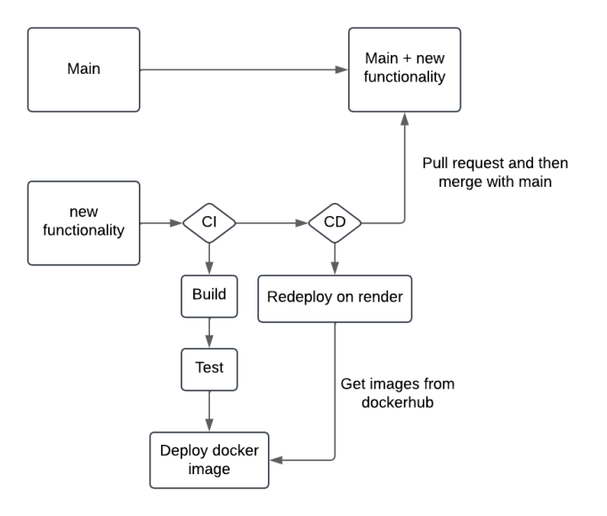

# Rapport de Projet DevOps

## Introduction

Ce projet a pour objectif de mettre en place une infrastructure DevOps complète en utilisant Docker, GitHub Actions pour l'intégration et le déploiement continu (CI/CD), et Render pour le déploiement des applications. Nous avons adopté la méthode **Trunk-Based Development**, où chaque modification est effectuée sur des branches dédiées et fusionnée dès que possible pour garantir une intégration continue rapide.

## Ce que nous avons fait

1. **Dockerfiles** : 
   - **Dockerfile web-client** : Le Dockerfile contient un multi-stage build pour obtenir l’image la plus petite possible à la fin. On copie ensuite le résultat du build dans notre image finale et on met l’utilisateur en `appuser`.
   - **Dockerfile vote-api** : Le Dockerfile contient un multi-stage build pour obtenir l’image la plus petite possible à la fin. On copie ensuite le résultat du build dans notre image finale et on met l’utilisateur en `appuser`.
   - **Dockerfile docs** : Le Dockerfile contient aussi un multi-stage build pour obtenir l’image la plus petite possible à la fin. On copie ensuite le résultat du build. Pour celui-ci, on laisse l’utilisateur en `root` dû à des problèmes techniques rencontrés.

2. **Docker Compose** : 
   Nous avons créé un fichier `docker-compose.yml` pour pouvoir lancer le frontend et le backend dans un réseau virtuel permettant la connexion entre eux. On y met les variables d'environnement nécessaires pour les containers, comme la base de données ou le lien vers `vote_api`.

3. **CI/CD avec GitHub Actions** : 
   Nous avons mis en place de l'intégration continue (CI) pour automatiser les tests, le build et le formatage de chaque application. Cela permet aussi de construire les images Docker et de les pousser sur Docker Hub. La CD ensuite permet de redéployer les applications sur Render avec la dernière version de l’image et du code sur `main`.

4. **Déploiement sur Render** : 
   Les services et les images Docker ont été déployés sur Render pour une gestion simplifiée.

5. **Database sur Neon** : 
   Notre base de données est sur Neon.

## Déploiement

Pour le déploiement, nous avons décidé de déployer le frontend, le backend et la documentation sur Render. Cela permet de centraliser les services.

### Liens des images et des apps :

- **web-client app** : [https://web-client-latest.onrender.com](https://web-client-latest.onrender.com)
- **vote-api app** : [https://vote-api-latest.onrender.com](https://vote-api-latest.onrender.com)
- **docs app** : [https://docs-latest.onrender.com](https://docs-latest.onrender.com)

- **web-client image** : [https://hub.docker.com/repository/docker/etienneb123/web-client/general](https://hub.docker.com/repository/docker/etienneb123/web-client/general)
- **vote-api image** : [https://hub.docker.com/repository/docker/etienneb123/vote-api/general](https://hub.docker.com/repository/docker/etienneb123/vote-api/general)
- **docs image** : [https://hub.docker.com/repository/docker/etienneb123/docs/general](https://hub.docker.com/repository/docker/etienneb123/docs/general)

## Contribuer au projet

Pour contribuer au projet, un nouveau développeur peut suivre ces étapes :

1. **Cloner le projet** : Utiliser `git clone <url-du-dépôt>` pour récupérer le projet localement.
2. **Créer une branche** : Créer une nouvelle branche à partir de `main` pour travailler sur une nouvelle fonctionnalité ou correction de bug. 

```
git checkout -b feature/nom-de-la-fonctionnalité
git add path to file(s)
gitmoji -c  # Choisir l'emoji, le titre du commit et le message dans le commit
git push origin feature/nom-de-la-fonctionnalité
```
# Créer une pull request et merger avec la branche main

### Schéma d’ajout d’une nouvelle fonctionnalité :



## Problème

**Dockerfile Docs** : Le Dockerfile pour les docs est tout le temps en mode root. Nous avions des problèmes lors de l'exécution du container, l’utilisateur `appuser` ne pouvait pas accéder à certains fichiers.

## Amélioration

- Correctement gérer les autorisations sur l’image Docker pour la documentation.
- Modifier la CD pour qu’elle s'exécute uniquement lors d’un push sur la branche `main`.
- Faire en sorte que la CI s'exécute toujours avant la CD pour éviter tout conflit.
